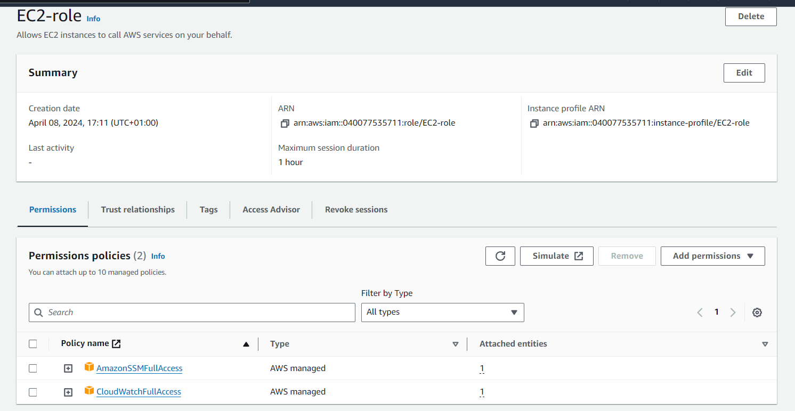

# Monitoring Infrastructure in AWS (CloudWatch and CloudTrail)

**Task: launch an EC2 instance and monitor it**

1. Create a new role in the IAM console with `CloudWatchFullAccess` and `SSMFullAccess` policy

    


2. Create a new parameter in the AWS System Manager Console - this parameter will define the metrics to monitor for the EC2 instance
 
    

    ```
    # paste this snippet code into "value" 

    {
        "metrics": {
            "append_dimensions": {
                "InstanceId": "${aws:InstanceId}"
            },
            "metrics_collected": {
                "mem": {
                    "measurement": [
                        "mem_used_percent"
                    ],
                    "metrics_collection_interval": 180
                },
                "disk": {
                    "measurement": [
                        "disk_used_percent"
                    ],
                    "metrics_collection_interval": 180
                }
            }
        }
    }
    ```


3. Launch an `Amazon Linux 2 instance` and attach the role you created to it

    


4. Create a script file to install Cloudwatch agent inside the instance

    ```
    sudo nano script.sh

    # paste this into the file:
    #!/bin/bash
    wget https://s3.amazonaws.com/amazoncloudwatch-agent/linux/amd64/latest/AmazonCloudWatchAgent.zip
    unzip AmazonCloudWatchAgent.zip
    sudo ./install.sh
    sudo /opt/aws/amazon-cloudwatch-agent/bin/amazon-cloudwatch-agent-ctl -a fetch-config -m ec2 -c ssm:/alarm/AWS-CWAgentLinConfig -s
    ```

5. Make the script executable with `sudo chmod +x script.sh` and run it `./script.sh`

    


6. Start the CWAgent and verify that it is running

    ```
     sudo /opt/aws/amazon-cloudwatch-agent/bin/amazon-cloudwatch-agent-ctl -m ec2 -a start

     sudo /opt/aws/amazon-cloudwatch-agent/bin/amazon-cloudwatch-agent-ctl -m ec2 -a status
    ```
 
    

7. Create a new Policy in the IAM console - use this Json code snippet 

    ```
    {
    "Version": "2012-10-17",
    "Statement": [
        {
            "Effect": "Allow",
            "Action": [
                "ec2:DescribeTags"
            ],
            "Resource": "*"
        }
      ]
    }
    ```
    


8. Attach the new Policy to the IAM  role you created at the beginning

    


9. Go to `CloudWatch console > Metrics > All metrics`

    - Browse for `CWAgent` and select either of the two options you see to view the metrics for your EC2 instance

    